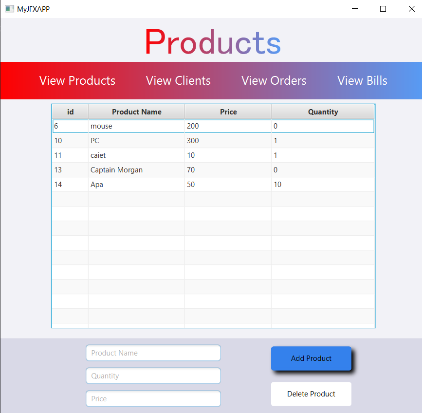
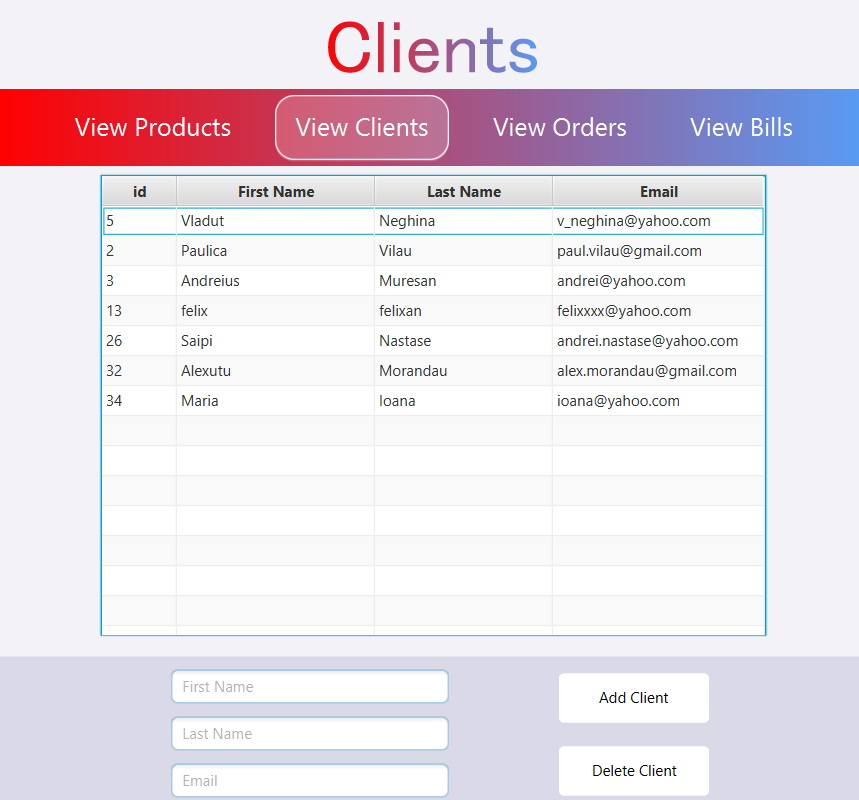

# Order Management System

## Overview
The **Order Management System** is a JavaFX-based application designed to **manage warehouse operations**, including **clients, products, orders, and bills**. It follows a **three-layer architecture** that ensures efficient database operations, business logic handling, and a user-friendly GUI.

## Application Screenshot
Below is an image of the Order Management System interface.
Products:





Clients:





## Features
- **Client Management** (Add, Edit, Delete, View Clients)
- **Product Management** (Add, Edit, Delete, View Products)
- **Order Processing** (Create, View, Manage Orders)
- **Billing System** (Generate and View Bills)
- **Graphical User Interface (GUI) with JavaFX**
- **Database Integration using PostgreSQL with DBeaver**

## Technologies Used
- **JavaFX** for GUI
- **FXML** for UI layout
- **CSS** for styling (`styles.css`)
- **PostgreSQL Database** for storing data
- **DBeaver** for database management
- **Java (OOP, DAO, Business Logic Layer)**
- **Concurrency & Data Validation**

## File Structure
```
OrderManagementSystem/
│── src/
│   ├── Model/                     # Database Models
│   │   ├── Client.java             # Client entity
│   │   ├── Product.java            # Product entity
│   │   ├── Order.java              # Order entity
│   │   ├── Bill.java               # Bill entity
│   ├── DataAccess/                 # Data Access Layer
│   │   ├── AbstractDAO.java        # Generic DAO operations
│   │   ├── ConnectionFactory.java  # Database connection handling
│   ├── BusinessLogic/              # Business Logic Layer
│   │   ├── AbstractBll.java        # Base BLL class
│   │   ├── ClientBLL.java          # Business logic for Clients
│   │   ├── ProductBLL.java         # Business logic for Products
│   │   ├── OrderBLL.java           # Business logic for Orders
│   │   ├── BillBLL.java            # Business logic for Bills
│   ├── Controllers/                # Controllers for GUI interactions
│   │   ├── HomeController.java     # Main Dashboard Controller
│   │   ├── ClientsController.java  # Controller for Clients view
│   │   ├── ProductsController.java # Controller for Products view
│   │   ├── OrderController.java    # Controller for Orders view
│   │   ├── BillController.java     # Controller for Bills view
│── resources/
│   ├── home-view.fxml              # JavaFX Home Layout
│   ├── clients-view.fxml           # Clients UI Layout
│   ├── products-view.fxml          # Products UI Layout
│   ├── orders-view.fxml            # Orders UI Layout
│   ├── bills-view.fxml             # Bills UI Layout
│   ├── styles.css                  # CSS for styling
│── docs/
│   ├── Craciunas_Victor_Documentation.pdf  # Project documentation
│── README.md  # This file
```

## Installation & Running the Application
### 1. Clone the Repository
```
git clone https://github.com/VictorCraciunas/Orders-Management.git
```

### 2. Configure Database (PostgreSQL with DBeaver)
- Install **PostgreSQL** and **DBeaver**.
- Open **DBeaver** and connect to your PostgreSQL database.
- Create a new database: `ordermanagement`
- Execute the provided SQL schema file to create the necessary tables.

### 3. Run the Application
- Open the project in **IntelliJ IDEA** or any Java IDE
- Ensure JavaFX is configured correctly
- Run `HomeController.java`

## How It Works
### **Managing Clients**
- Add new clients with names, addresses, and contact details
- Edit existing client information
- Remove clients from the system

### **Managing Products**
- Add new products with names, descriptions, and stock levels
- Edit product details
- Delete products when necessary

### **Processing Orders**
- Create new orders by selecting clients and products
- Automatically generate invoices for orders
- View existing orders in a structured table

### **Billing System**
- Generate invoices upon successful order placement
- Display past transactions in the bills section

### **GUI Interaction**
- Navigate using the **menu bar**
- Perform CRUD operations using **table views** and **buttons**
- Use **interactive forms** to manage data

## Future Improvements
- **Add authentication** (Admin/User roles)
- **Graphical analytics for sales reports**
- **Enhanced error handling** for invalid data inputs


